import { Image } from 'astro:assets';
import { Steps, Card, Tabs, TabItem, LinkButton, CardGrid } from "@astrojs/starlight/components";

<LinkButton href={"/int4101/print/lab2"} icon="seti:pdf" target={"_blank"}>Print</LinkButton>

:::note
จงแปลข้อควรรู้และคำศัพท์
:::
## คำศัพท์

### Hacking Terms

<Card title='Hacking Terms'>
<Tabs>
<TabItem label='โจทย์'>

1. DNS Rebinding

Cyberattack that exploits how browsers handle domain name resolution to bypass the same- origin policy and gain unauthorized access to private networks or systems.

2. Shadow IT

Use of information technology systems, applications, devices, or services within an organization without the knowledge, approval, or oversight of the IT department.

3. Fragmentation Attack

Network-based cyberattack where attackers exploit vulnerabilities in how packets are fragmented and reassembled during transmission.

4. Hardware Keylogger

A physical device used to monitor and record every keystroke made on a computer or other device. It is typically installed between a keyboard and a computer or embedded within a keyboard itself.

5. Smishing

A type of phishing attack where attackers use text messages (SMS) to deceive individuals into providing sensitive information.

6. Juice Jacking

A cyberattack where attackers exploit public charging stations, such as those in airports, hotels, or cafes, to steal data or install malware on a device.

7. MAC Flooding

MAC Flooding is a network attack that exploits the behavior of a network switch by overwhelming its MAC address table with fake entries.

8. Key Exchange Manipulation

Cyberattack where an attacker interferes with or alters the process of exchanging cryptographic keys between two parties.

9. Rogue Access Point

An unauthorised wireless AP mimics legitimate networks to intercept data, inject malware, or gain access.

10. Logic Bomb

A Logic Bomb is a piece of malicious code that is intentionally inserted into a legitimate program and is designed to execute when specific conditions are met.

11. Heap Exploitation

Cyberattack that targets vulnerabilities in the heap, a region of memory used by applications for dynamic memory allocation during runtime.

12. Password Spraying

Password spraying is a cyberattack technique where an attacker attempts to access multiple accounts using a small set of commonly used passwords.

13. Directory Traversal

Also known as Path Traversal, is a type of web application vulnerability that allows an attacker to access files or directories on a server that are outside the intended web root folder.

14. Eavesdropping

Also known as sniffing or type network eavesdropping, is a of cyberattack where an attacker intercepts and listens to network communications to steal sensitive information.

15. Credential Harvesting

Type of cyberattack where an attacker collects or steals usernames, passwords, and other login credentials from victims.

16. Rainbow Table Attack

A password-cracking method that uses precomputed tables of hashed passwords to quickly reverse cryptographic hashes that reveals the original plaintext passwords.

17. Spyware

A type of malicious software (malware) designed to secretly monitor a user's activity and collect information without their knowledge or consent.

18. Bluejacking

A type of Bluetooth-based attack where an attacker sends unsolicited messages, images, or files to nearby Bluetooth-enabled devices.

19. Typosquatting

Typosquatting (also known as URL hijacking) is a form of cyberattack that exploits common misspellings or typographical errors users make when entering website URLs.

20. Pass-the-hash-attack

A type of cyberattack where an attacker uses a hashed password, instead of the plaintext password, to authenticate and gain access to a system or network.

21. DNS Tunelling

An attacker uses the Domain Name System (DNS) protocol to transmit data covertly between a compromised device and an attacker- controlled server.e

22. Privilege Escalation

Privilege escalation is the act of gaining higher-level access or permissions within a system than initially authorized.

23. Deep Packet Inspection

Deep Packet Inspection (DPI) is an advanced network filtering technique that examines the content of packets as they pass through devices like firewalls or routers.

24. Threat Hunting

Threat hunting is a proactive cybersecurity approach where teams actively search for threats in a network rather than relying on automated detection systems.

25. Session Hijacking

Session Hijacking is a type of cyberattack where an attacker takes over a valid user session to gain unauthorized access to information or services.

26. Sidejacking

Sidejacking is a type of session hijacking attack where an attacker intercepts and steals unencrypted session cookies to take control of a user's active session.

27. Watering Hole Attack

A Watering Hole Attack is a type of cyberattack where an attacker compromises a legitimate website that is frequently visited by a specific target group.

28. Denial Of Service(DOS)

A Denial of Service (DoS) attack aims to make a system or network unavailable by overwhelming it with excessive requests or exploiting vulnerabilities.

29. Clickjacking

Clickjacking is an attack where an attacker tricks a user into clicking on something different than intended by overlaying invisible elements on a legitimate webpage.

30. Vishing

Vishing is a social engineering phone scam where attackers trick people into revealing sensitive information.

31. Command Injection

Command Injection is a vulnerability that allows an attacker to execute arbitrary commands on the host operating system through a vulnerable application.

32. Privilege Escalation

Privilege Escalation is a process where an attacker gains higher access rights or privileges than originally intended.

33. Shimming

A technique that inserts a code between an application and the OS to modify behavior or bypass security.

34. Evil Twin Attack

An Evil Twin Attack is where an attacker sets up a fake Wi-Fi access point to trick users into connecting, enabling interception and manipulation of their network traffic.

35. Buffer Overflow

A Buffer Overflow happens when excess data overwrites memory, potentially allowing attackers to crash, corrupt, or control the program.

36. Credential Stuffing

Credential Stuffing is when attackers use stolen usernames and passwords from one breach to access accounts on other sites.

37. DNS Spoofing

is a cyberattack where an attacker alters DNS (Domain Name System) records to redirect traffic from a legitimate website to a malicious one.

38. ARP Poisoning

is a network attack where the attacker sends falsified ARP (Address Resolution Protocol) messages onto a local network.

39. Keylogger

is a type of surveillance software or hardware that tracks and records every keystroke made on a device.

40. Footprinting

Footprinting is the process of gathering as much information as possible about a target system, network, or organisation to identify potential attack vectors.

41. Brute Force Attack

A brute force attack involves trying every possible combination of letters, numbers, and special characters until the correct password is found. This method relies on the computational power at the attacker’s disposal and is often used against web applications to crack passwords and gain access to user accounts.

42. *Cross-Site Scripting (XSS)

Attackers inject malicious scripts into web pages, allowing them to steal data, or perform actions in the victim's browser.

43. Shell

A user interface that allows interaction with the operating system, often used by hackers to execute commands.

44. Exploit Kit

A software toolkit used by cybercriminals to exploit vulnerabilities in software and systems.

45. Social Engineering

The use of psychological manipulation to trick individuals into divulging confidential information.

46. CTF

A cybersecurity competition where participants solve challenges related to finding and exploiting vulnerabilities.

47. CVSS

Common Vulnerability Scoring System - a standard way to capture the severity of a vulnerability.

48. SQL Injection

SQL injection is a code injection technique used to attack data-driven applications. Malicious SQL statements are inserted into an entry field for execution (e.g., to dump the database contents to the attacker). SQL injection is one of the oldest, most prevalent, and most dangerous web application vulnerabilities.

49. Zero-day

A zero-day vulnerability is one that is unknown to the software vendor or to antivirus vendors before it becomes active and exploitable. This means the attackers have a "zero day" head start, hence the name, making it particularly dangerous.

50. Backdoor

A backdoor in a computer system or cryptosystem is a method of bypassing normal authentication, securing unauthorized remote access to a computer, while attempting to remain undetected. The backdoor access can be installed by the system designer, or it can be the result of a flaw, and it allows for remote command and control by unauthorized users.

51. Man-in-the-middle

In a Man-in-the-Middle (MitM) attack, the attacker secretly intercepts and possibly alters the communication between two parties who believe they are directly communicating with each other. This attack can be used to steal personal information, login credentials, or credit card numbers and to eavesdrop on messages.

52. Phishing

Phishing is a cyberattack that uses disguised email as a weapon. The goal is to trick the email recipient into believing that the message is something they want or need — for example, a request from their bank or a note from someone in their company — and to click a link or download an attachment.

53. Exploit

An exploit is a piece of software, a set of data, or a sequence of commands that takes advantage of a bug or vulnerability in order to cause unintended or unanticipated behavior to occur on computer software or hardware. It often includes gaining control over a computer system or allowing an attacker to introduce malware.

54. Payload

Is the part of an exploit that performs the intended action on the target system.

55. Data Poisoning

Attackers deliberately inject malicious, false, or manipulated data into a system's dataset. This attack targets systems that rely on data for decision-making, particularly machine learning (ML) models, artificial intelligence (AI) systems, and data analytics.

56. fileless malware

Fileless malware is a type of malicious activity that uses native, legitimate tools built into a system to execute a cyberattack. Unlike traditional malware, which typically requires a file to be downloaded and installed, fileless malware operates in memory or manipulates native tools, making it harder to detect and remove. The exploitation of legitimate tools is often referred to as living off the land (LOTL).

57. Binary planting

Binary Planting also known as DLL Hijacking or Executable Planting, is a cyberattack where an attacker exploits how applications load external binary files to execute malicious code.

58. Malware

Malware, short for malicious software, encompasses any software intentionally designed to cause damage to a computer, server, client, or computer network. By disrupting operations, stealing information, or gaining access to private computer systems, malware acts as the primary tool for cybercrime.

59. Ransomware

Ransomware is a subset of malware where the data on a victim's computer is locked, typically by encryption, and payment is demanded before the ransomed data is decrypted and access returned to the victim. The motives for ransomware attacks are nearly always monetary, and unlike other types of attacks, the victim is usually notified and given instructions on how to recover from the attack.

60. Botnet

A botnet is a network of private computers infected with malicious software and controlled as a group without the owners' knowledge. Botnets can be used to perform Distributed Denial of Service (DDoS) attacks, steal data, send spam, and allows the attacker to access the device and its connection.

61. DDoS (Distributed Denial of Service)

A Distributed Denial of Service (DDoS) attack is an attempt to crash a website or online service by overwhelming it with a flood of internet traffic. This is achieved by utilizing multiple compromised computer systems as sources of traffic. DDoS attacks exploit the specific capacity limits that apply to any network resources.

62. VPN (Virtual Private Network)

A Virtual Private Network (VPN) extends a private network across a public network, allowing users to send and receive data across shared or public networks as if their computing devices were directly connected to the private network. This provides the benefits of security, functionality, and management policies of the private network.

63. Trojan Horse

A Trojan horse, or Trojan, is any malware which misleads users of its true intent. The term is derived from the Ancient Greek story of the deceptive Trojan Horse that led to the fall of the city of Troy. Trojans are generally spread by some form of social engineering, for example, where a user is duped into executing an email attachment disguised to appear not suspicious.

64. Rootkit

Rootkits are a type of malware designed to gain unauthorized access to a computer or area of its software and hide the existence of certain processes or programs from normal methods of detection. Rootkits allow viruses and malware to "hide in plain sight" by disguising as necessary files that your antivirus software will overlook.

65. Whitelisting

Whitelisting is a cybersecurity strategy under which a user can only take actions on their computer that an administrator has explicitly allowed in advance. It is the opposite of more common security strategies that block access to unauthorized or unknown applications. This can protect against malware by only allowing pre-approved applications to run.

66. Black Hat

A black hat hacker is an individual with extensive computer knowledge whose purpose is to breach or bypass internet security. The black hat hacker is known for hacking into computer networks with malicious intent, stealing data, corrupting the system, or shutting it down entirely.

67. White Hat

A white hat hacker, also known as an ethical hacker, is a cybersecurity expert who practices hacking to identify security vulnerabilities that a malicious hacker could potentially exploit. White hats aim to improve security by exposing weaknesses before malicious hackers can detect and exploit them.

68. Grey Hat

A grey hat hacker lies between a black hat and a white hat hacker. They may exploit security weaknesses without the owner’s permission or knowledge, but their intentions are to report the vulnerabilities to the owner, sometimes requesting a small fee to fix the issue.

69. Encryption

Encryption is the process of encoding information in such a way that only authorized parties can access it. By converting the original representation of the information, known as plaintext, into an alternative form known as ciphertext, encryption prevents unauthorized individuals from accessing the data.

70. Firewall

A firewall is a network security device that monitors incoming and outgoing network traffic and decides whether to allow or block specific traffic based on a defined set of security rules. Firewalls have been a first line of defense in network security for over 25 years, establishing a barrier between secured and controlled internal networks that can be trusted and untrusted outside networks.

71. Spoofing

Spoofing is a fraudulent or malicious practice in which communication is sent from an unknown source disguised as a source known to the receiver. Spoofing can apply to emails, phone calls, and websites, or can be more technical, such as a computer spoofing an IP address, Address Resolution Protocol (ARP), or Domain Name System (DNS) server.

72. Patch

A patch is a set of changes to a computer program or its supporting data designed to update, fix, or improve it. This includes fixing security vulnerabilities and other critical bugs, with patches usually being issued by the software vendor. Regular patching is often cited as a critical component of comprehensive cybersecurity practices

73. Penetration Testing (Pen Testing)

Penetration testing, often called "pen testing," is a simulated cyber attack against your computer system to check for exploitable vulnerabilities. In the context of web application security, penetration testing is used to augment a web application firewall (WAF).

74. Skimming

Skimming is the theft of credit card information used in an otherwise legitimate transaction. It is typically an "inside job" by a dishonest employee of a legitimate merchant and usually involves the employee swiping the card on a small device known as a skimmer to record the information to use in fraudulent transactions later.

75. Spear Phishing

Spear phishing is an advanced form of phishing that targets specific individuals, organizations, or businesses. Unlike broad phishing attacks, spear phishing attackers gather and use personal information about their target to better disguise their attack and increase their chances of success.

76. Vishing

Vishing, or voice phishing, involves the use of telephone communication to scam the user into surrendering private information that will be used for identity theft. The scammer usually pretends to be from a legitimate organization and uses social engineering to steal sensitive information.

77. Wardriving

Wardriving involves searching for Wi-Fi wireless networks by a person in a moving vehicle, using a laptop or smartphone to detect and map networks, often exploiting insecure Wi-Fi signals to gain unauthorized access.

78. Worm

A computer worm is a type of malware that spreads copies of itself from computer to computer. A worm can replicate itself without any human interaction, and it does not need to attach itself to a software program in order to cause damage.

79. Zombie Computer

A zombie computer is a machine compromised by a hacker, a virus, or a trojan horse and can be used to perform malicious tasks under remote direction. Botnets, networks of zombie computers, are often used to send spam emails or launch DDoS attacks.

80. Doxxing

Doxxing is the internet-based practice of researching and publicly broadcasting private or identifying information about an individual or organization. The methods employed to acquire this information include searching publicly available databases and social media websites, hacking, and social engineering.

81. Honeypot

A honeypot is a computer system that is set up to act as a decoy to lure cybercriminals and to detect, deflect, or study attempts at unauthorized use of information systems. Honeypots are designed to mimic systems that an intruder would like to break into but limit the access to the system and the data within.

82. Pharming

Pharming is a cyberattack intended to redirect a website's traffic to another, bogus site. Pharming can be conducted either by changing the hosts file on a victim’s computer or by exploitation of a vulnerability in DNS server software.

83. Root Access

Root access refers to having the highest level of control over a computer or network. It allows for the modification of system functionalities and settings, installation of software, and access to all files on the system. Root access provides complete administrative control over a wide variety of system functions and files.

84. Cryptocurrency Mining Malware

Cryptocurrency mining malware covertly utilizes the processing power of the infected computer to mine cryptocurrency, typically without the user's consent. This type of malware can significantly degrade system performance, increase electricity costs, and often serves as a gateway for other malicious activities.

85. Digital Footprint

A digital footprint comprises the traces of information that individuals leave online through activities like visiting websites, posting on social media, or subscribing to online services. This footprint can reveal a lot about an individual's preferences, behavior, and identity, making it valuable for both legitimate and malicious actors.

86. Dumpster Diving

Dumpster diving in the context of information security involves searching through physical trash to find documents, storage media, or other items that contain sensitive information. This discarded information can be exploited for identity theft, corporate espionage, or other malicious purposes.

87. Endpoint Detection and Response (EDR)

Endpoint Detection and Response (EDR) solutions provide real-time monitoring and automated response to advanced threats targeting endpoint devices. EDR tools actively seek out and isolate threats, offering detailed threat analysis and insights to prevent future attacks.

88. Evil Twin

An evil twin attack involves setting up a fraudulent Wi-Fi access point that mimics the appearance of a legitimate one to deceive users into connecting. Once connected, attackers can monitor traffic, capture login credentials, and access sensitive information transmitted by unsuspecting users.

89. Fuzzing

Fuzzing is a dynamic code analysis technique used to identify vulnerabilities in software applications. By automatically feeding unexpected or random data inputs into the program, fuzzing aims to trigger errors, crashes, or memory leaks that could be exploited by attackers.

90. Ghostware

Ghostware refers to malware that eludes detection by hiding its presence after executing a malicious activity. This allows the malware to operate or transfer data without being detected by security software, making it particularly challenging to trace and eliminate.

91. Hashing

Hashing is a cryptographic process that transforms any form of data into a unique fixed-size string of characters, which serves as a fingerprint for that data. Unlike encryption, hashing is a one-way process, making it impossible to reverse the hash back to its original data, thus ensuring data integrity.

92. Insider Threat

An insider threat arises from individuals within the organization, such as employees, contractors, or business partners, who misuse their access to harm the organization's information or systems. Insider threats can manifest through data theft, sabotage, or misuse of access privileges.

93. Jailbreaking

Jailbreaking refers to the process of removing software restrictions imposed by the operating system on devices like smartphones and tablets. This allows users to install unauthorized apps, extensions, and themes, but can also expose the device to security vulnerabilities.

94. Kali Linux

Kali Linux is a Linux distribution designed for digital forensics and penetration testing. It comes preloaded with a comprehensive suite of tools for security auditing, network analysis, and vulnerability assessment, making it a valuable resource for security professionals.

95. Lateral Movement

Lateral movement refers to the techniques used by attackers to navigate through a network, moving from one system to another, to gain access to valuable assets or data. This stage of a cyber attack is critical for expanding the attacker's foothold within the target environment.

96. Macro Virus

A macro virus is a type of malware that embeds malicious code within macros of document files, such as Word or Excel documents. When the infected document is opened, the macro virus executes, potentially leading to data corruption, file encryption, or other system disruptions.

97. Network Sniffing

Network sniffing involves capturing data packets as they travel across a network. Attackers use sniffing to intercept and analyze traffic for sensitive information, such as passwords and financial data, often without detection.

98. Obfuscation

Obfuscation involves deliberately making source code, machine code, or algorithmic logic difficult to understand. This technique can be used by programmers to protect intellectual property or by attackers to conceal malware's true purpose from analysis tools and security professionals.

99. Piggybacking

Piggybacking on a wireless network refers to the unauthorized access of someone else's Wi-Fi network. This practice not only steals network resources but also poses a significant security risk, as it could be used for illegal activities or to gain unauthorized access to networked devices.

100. Quarantine

Quarantining involves isolating a suspected malicious file, software, or device to prevent it from causing harm or spreading within a computer or network. This containment strategy allows for safe analysis and decision-making regarding the disposition of the potential threat.

101. RAT (Remote Access Trojan)

A Remote Access Trojan (RAT) is a type of malware that allows hackers to control a device remotely without the user's knowledge. RATs can be used for a variety of malicious purposes, including spying, stealing data, or distributing other malware.

102. Sandboxing

Sandboxing is a security technique in which a separate, secure environment is created to run and analyze untrusted programs or code, preventing them from accessing or harming the host device or network.

103. Social Media Engineering

Social Media Engineering form of cyber manipulation that involves tricking individuals on social media platforms into divulging confidential information or performing actions that would compromise their security. This technique leverages the inherent trust and openness found within social networks.

104. Tailgating

An unauthorized person following an authorized person into a secured area, often by closely following them through a door meant to restrict access. Tailgating is a physical security breach that can lead to cyber breaches if intruders gain access to secure locations.

105. Threat Intelligence

Information used by an organization to understand the threats that have, will, or are currently targeting the organization. This data is used to prepare, prevent, and identify cyber threats looking to take advantage of valuable resources.

106. Two-Factor Authentication (2FA)

A security process in which users provide two different authentication factors to verify themselves. This method is a more secure way of authenticating because it adds a second layer of verification beyond just a password.

107. Vulnerability Assessment

The process of identifying, quantifying, and prioritizing (or ranking) the vulnerabilities in a system. It provides the organization with the necessary knowledge, awareness, and risk background to understand the threats to its environment and react appropriately.

108. Whaling

A specific form of phishing aimed at senior executives and other high-profile targets within businesses. The attack may involve social engineering techniques to trick the victim into performing a detrimental action, such as transferring funds or revealing sensitive information.

109. Zero Trust Architecture

A security concept centered on the belief that organizations should not automatically trust anything inside or outside its perimeters and instead must verify anything and everything trying to connect to its systems before granting access.

110. Clickjacking

A technique where the attacker tricks a user into clicking on something different from what the user perceives, potentially revealing confidential information or allowing others to take control of their computer.

111. Drive-by Download

Refers to the unintentional download of malicious code to your computer or mobile device that exploits vulnerabilities in web browsers, operating systems, or apps. It often does not require any user interaction to execute.

112. Egress Filtering

The process of monitoring and potentially restricting the flow of information outbound from one network to another. This can help prevent sensitive data from leaving the network and block unauthorized access.

113. Firmware

Low-level software that is embedded into the hardware of electronic devices. Firmware provides the necessary instructions for how the device communicates with other computer hardware.

114. Grayware

Software that, while not explicitly malicious, can worsen the performance and security of computers, introduce vulnerabilities, and cause significant annoyances to the user.

115. Heuristic Analysis

A technique used by antivirus software to detect previously unknown computer viruses, as well as new variants of viruses already in the "wild," by examining code for suspicious properties.

116. IOC (Indicator of Compromise)

A piece of forensic data, such as system log entries or files, that identifies potentially malicious activity on a system or network. IOCs help security professionals detect data breaches, malware infections, or other threat activities.

117. Jitterbugging

A method used by cybercriminals to insert jitter, or unpredictable time delays, into network communications. This can disrupt the timing of encryption algorithms and make communications more susceptible to interception and decryption.

118. Kerberoasting

A type of cyberattack against the Kerberos authentication protocol to crack the passwords of service accounts in Windows domains. It exploits the way that Kerberos handles service principal names (SPNs) to retrieve hashed credentials vulnerable to offline brute-force attacks.

119. Logic Gate

In the context of digital circuits, a logic gate is a basic building block of a digital system that is used to perform a boolean function; in cybersecurity, it can refer metaphorically to decision points in security protocols or malware.

120. Mitigation

The process of reducing the severity, seriousness, or painfulness of something. In cybersecurity, it refers to the measures taken to reduce the adverse effects of threats and vulnerabilities on information and information systems.

121. Nonce

A number or bit string used only once, in security engineering, during an authentication process or cryptographic communication. Nonces prevent old communications from being reused in replay attacks.

122. Patch Management

A strategy for managing patches or updates for software applications and technologies. Patch management helps ensure that the software's security and functionality are up-to-date, mitigating potential vulnerabilities.

123. Red Team

In cybersecurity, a Red Team is a group that plays the role of an adversary, using hacking techniques to test the effectiveness of a system's security. This practice helps identify weaknesses before actual attackers can exploit them.

124. Blue Team

A group responsible for defending an organization's use of information systems by maintaining its security posture against a group of mock attackers (Red Team). The Blue Team aims to detect and respond to the attacks effectively.

125. Purple Team

Purple Teaming is a collaborative effort in which the offensive Red Team and defensive Blue Team work closely together to share insights, feedback, and learning outcomes to enhance overall security.

126. Risk Assessment

The process of identifying, analyzing, and evaluating risk. It helps organizations understand the cybersecurity risks to organizational operations (including mission, functions, image, and reputation), organizational assets, and individuals.

127. Security Operations Center (SOC)

A centralized unit that deals with security issues on an organizational and technical level. A SOC within a building or facility is a central location from where staff supervises the site, using data processing technology.

128. VPN Kill Switch

A security feature that automatically disconnects a user from the internet until the VPN connection is restored. This prevents the user's IP address and personal data from being exposed due to the sudden drop of the VPN connection.

129. WAF (Web Application Firewall)

A security barrier specifically designed to monitor, filter, and block data packets as they travel to and from a website or web application. It applies a set of rules to an HTTP conversation, covering common attacks such as cross-site scripting (XSS) and SQL injection.

130. X.509 Certificate

A standard defining the format of public key certificates. X.509 certificates are used in many Internet protocols, including TLS/SSL, which is the basis for HTTPS, the secure protocol for browsing the web.

131. YARA Rules

In cybersecurity, YARA is a tool used for identifying and classifying malware samples. YARA rules allow researchers to create descriptions of malware families based on textual or binary patterns.

132. Zero-Day Exploit

An attack that targets a previously unknown vulnerability, for which there is no available fix or patch at the time of discovery. The attacker exploits the flaw before developers have an opportunity to address it.

133. Attribution

The process of identifying and assigning responsibility to the perpetrator of a cyber attack. Accurate attribution is often challenging due to the ability of attackers to disguise their identity and location.

134. Beaconing

The process by which malware communicates back to the attacker to indicate that it has successfully infiltrated the target system. Beaconing can also be used to receive commands or exfiltrate data.

135. Chain of Custody

In digital forensics, the chronological documentation or paper trail, showing the seizure, custody, control, transfer, analysis, and disposition of evidence, physical or electronic.

136. Data Exfiltration

The unauthorized transfer of data from a computer or other device. This can be conducted manually by an individual or automatically through malicious programming on the internet or a network.

137. Encryption Key

A string of characters used to encrypt or decrypt data. Keys are used in conjunction with encryption algorithms to securely encode data, ensuring that only those with the correct key can access the original information.

138. Forensic Analysis

The process of examining and analyzing digital information for use as evidence in court. Cyber forensic analysis involves recovering and investigating material found in digital devices, often in relation to computer crime.

139. Geofencing

A location-based service in which an app or other software uses GPS, RFID, Wi-Fi, or cellular data to trigger a pre-programmed action when a mobile device or RFID tag enters or exits a virtual boundary set up around a geographical location, known as a geofence.

140. Hacker Ethics

A set of values that guide the behavior of hackers, which includes access to computers—and anything that might teach you something about the way the world works—should be unlimited and total. It emphasizes freedom of information, improvement to the quality of life, and opposition to monopoly by leveraging technology.

</TabItem>
</Tabs>
</Card>
## ข้อควรรู้
### Ethical Hacking
<Card title='Information Gathering'>
<Tabs>
<TabItem label='โจทย์'>

1. Open Source Inteligence 

Explore related websites, social media, forums and public databases for information on the target.

2. Google Darking 

Craft advanced search queries to find sensitive information exposed on websites.

3. WHOIS Lookup 

Retrieve domain registration information to identify domain owners and administrators, contact details and domain expiration dates.

4. DNS Enumeration 

Perform DNS queries to gather information about the target's domain names and associated IP addresses.

5. Email Harvesting 

Search for email addresses associated with the target organization on websites, social media, and public directories.

6. Network Scanning

Scan the target network to identify live hosts, open ports, and running services.

</TabItem>
</Tabs>
</Card>

<Card title='Note Taking'>
:::note
Taking notes help you record findings, make decisions, support teamwork, ensure compliance, assist in incident response, and show professionalism
:::

<Tabs>
<TabItem label='โจทย์'>
**Taking Note**

Use Structured Formats 

- Adopt structured note-taking formats such as bullet points, headings, and subheadings to organize information logically.

Document Processes and Procedures 

- including documenting methodologies, tools used, configuration settings, and any deviations or discoveries made

Record Technical Details

- including IP addresses, ports, vulnerabilities identified, exploit techniqu and command-line instructions used.

Record Activities

- Keep a chronological log of activities performed during engagements, noting timestamps, actions taken, and outcomes.

**Presenting your Notes**

Include Screenshots and Diagrams of important findings

- e.g.network diagrams, system architectures, or flowcharts. Visual aids can enhance understanding and provide additional context for your observations.

Highlight Critical Findings and Risks 

- Emphasize critical findings, vulnerabilities with high severity, or risks that require immediate attention.

Document Assumptions and Limitations 

- such as restricted access, incomplete data, or constraints that may affect the scope or accuracy of findings.

Record Communication and Recommendations

- Summarize communications with stakeholders, clients, or team members regarding findings, recommendations, and action plans. Document agreed-upon next steps and deadlines.

</TabItem>
</Tabs>
</Card>

<Card title='Problem solving and Debugging'>
<Tabs>
<TabItem label='โจทย์'>

Search Online Resources

- Utilize forums, cybersecurity websites, and documentation.

Use Drebugging Tools

- Employ tools like Wireshark, GDB, and others for in-depth analysis.

Replicate the Issue

- Try to reproduce the problem in a controlled environment.

Check for Updates

- Ensure all software and tools are up to date.

Collaborate

- Reach out to the community or colleagues for insights and advice.

</TabItem>
</Tabs>
</Card>

<Card title='What is OSINT'>
<Tabs>
<TabItem label='โจทย์'>

What is Open Source Intelligence (OSINT)

Process of gathering, analyzing, and leveraging publicly available information from **open sources** to gather intelligence about a target, organization, or individual.

**Open Source Examples:**
- Forums
- Social Media
- News
- Websites
- Records and Archives

1. Gathering Information

- Use search engines, social media, company websites, and OSINT tools like Maltego to collect publicly available data.

2. Analyzing Data

- Analyze and correlate the data to identify patterns, relationships, and potential vulnerabilities.

3. Identifying Security Risks

- Conduct reconnaissance and footprinting to identify security risks, threats, and vulnerabilities that attackers may exploit.

4. Ethical and Legal Considerations

- It's essential for ethical hackers to adhere to ethical and legal guidelines when conducting OSINT activities.

</TabItem>
</Tabs>
</Card>

<Card title='Benefits of OSINT (Open-source Inteligence)'>
:::note
OSINT can uncover sensitive data like leaked credentials, unprotected IPs, or even employee oversharing! Ethical hackers use this intel to secure systems before attackers strike.
:::
<Tabs>
<TabItem label='โจทย์'>

1. Unveils Key Vulnerabilities 

- OSINT tools help ethical hackers discover exposed data, misconfigured systems, and weak points in a network.
- Example: Finding unprotected IP addresses, sensitive documents, or outdated software versions.

2. Cost-Effective Reconnaissance 

- OSINT leverages publicly available information, making it a low-cost yet highly effective approach to gathering data for penetration testing.
- Ethical hackers can often avoid time-consuming manual scans by focusing on the information OSINT reveals.

3. Realistic Attack Simulations

- By replicating how a malicious hacker might exploit public data, OSINT enables ethical hackers to identify and mitigate vulnerabilities before they are exploited.
- Example: Analyzing employee social media to uncover phishing risks.

4. Early Detection of Data Leaks

- OSINT can reveal sensitive data that has leaked online, such as customer databases or credentials exposed in breaches.
- Ethical hackers use this to protect their clients before attackers exploit the information.

5. Strengthens Awareness & Defense

- Ethical hackers use OSINT to educate organizations on the importance of securing their publicly available information.
- Example: Preventing metadata exposure in shared documents or photos.

6. Enhances Threat Intelligence

- OSINT enables ethical hackers to map out an organization's digital footprint, creating a clearer picture of potential threats.
- This can include domains, subdomains, employee details, and exposed technologies.

</TabItem>
</Tabs>
</Card>

### Hacker
<Card title='Hacker Type'>
<Tabs>
<TabItem label='โจทย์'>

1. White Hat hackers

Also known as ethical hackers, are cybersecurity professionals who use their skills defensively, engaging in legal and authorized activities

2. Black Hat hackers

Black hat hackers are individuals who engage in malicious and illegal activities for personal gain, financial profit, or malicious intent.

3. Gray Hat hackers

Gray hat hackers operate between legal and illegal hacking activities, sometimes without malicious intent or financial gain but without explicit authorization.

</TabItem>
</Tabs>
</Card>

### Testing
<Card title='White Box Testing vs. Black Box Testing'>
<Tabs>
<TabItem label='โจทย์'>

1. White Box Testing

Testing with full knowledge of the system's code, architecture, and design.
Focuses on internal code correctness and efficiency.

2. Black Box Testing

Testing without prior knowledge of the internal workings of the system or application.
Focuses on functional correctness.

</TabItem>
</Tabs>
</Card>

<Card title='pentesting'>
<Tabs>
<TabItem label='โจทย์'>

What is Pentesting

- A penetration test (or pen test) is a simulated cyberattack against a computer system to check for exploitable vulnerabilities.
- Ethical hackers use this method to identify weaknesses in systems, applications, or networks and help organizations strengthen their security before malicious attackers can exploit them.

Types of Pentesting

1. Network Penetration Testing:
- Focuses on identifying vulnerabilities in wired and wireless networks. It includes the testing of routers, switches, firewalls, VPNs, and other network components.
2. Web Application Penetration Testing:
- Focuses on the security of web applications and their components (e.g., front-end, back-end, APIs).
3. Social Engineering Penetration Testing:
- Simulates social engineering attacks, such as phishing, to evaluate how vulnerable employees are to these types of attacks.
4. Mobile Application Penetration Testing:
- Tests the security of mobile applications, including iOS and Android apps.
5. Wireless Penetration Testing:
- Targets the security of wireless networks (Wi-Fi) to uncover issues such as weak encryption (e.g., WEP), vulnerabilities in encryption protocols (e.g., WPA2), rogue access points, and wireless client vulnerabilities.

Testing Methods

1. Black Box Testing:
- The tester has no prior knowledge of the target system. They approach the test as an external attacker would, relying on publicly available information and initial reconnaissance.
2. White Box Testing:
- The tester has full knowledge of the target system, including source code, architecture diagrams, and administrative privileges.
3. Gray Box Testing
- The tester has partial knowledge of the system, such as login credentials or specific details about the system's infrastructure.

</TabItem>
</Tabs>
</Card>

### Bug Bounty

<Card title='Bug Bounty'>
<Tabs>
<TabItem label='โจทย์'>

What is Bug Bounty

A Bug Bounty program is an initiative by organizations, often tech companies, to reward individuals for identifying and reporting security vulnerabilities in their software, websites, or applications.

The main goal is to encourage ethical hackers to find and disclose flaws before they can be exploited by malicious actors.

Bug Bounty programs

1. Public Bug Bounty Programs:
- Open to anyone who wants to participate.

2. Private Bug Bounty Programs:
- Invitation-only, where select researchers are asked to participate.

**Participants are typically rewarded with monetary compensation, though some programs might offer other rewards like recognition, job opportunities, or merchandise.**

Why Companies use Bug Bounty Programs 

1. Enhanced Security: By incentivizing external researchers to find bugs, companies can uncover vulnerabilities that might have been missed during internal testing.

2. Cost-Effective: Paying for found vulnerabilities is often more cost-effective than dealing with the consequences of a breach.

3. Community Engagement: It fosters a relationship with the security community and can improve the organization's reputation.

Common Vulnerabilities Targeted in Bug Bounty Programs

1. Cross-Site Scripting (XSS)
2. SQL Injection
3. Remote Code Execution (RCE)
4. Authentication Bypass
5. Information Disclosure

</TabItem>
</Tabs>
</Card>

### Vulnerability Assessment

<Card title='Vulnerability Assessment'>

:::note
Vulnerability assessment plays a critical role in identifying and mitigating security vulnerabilities within organisations, helping them strengthen their defences and protect against potential cyber threats.
:::

<Tabs>
<TabItem label='โจทย์'>

Utilize Automated Scanning

Employ tools like Nessus or OpenVAS to efficiently scan for vulnerabilities.

Prioritize and Understand Impact

Focus on critical vulnerabilities and consider their impact within the target environment.

Think Like an Attacker

Anticipate potential attack vectors and methods to identify vulnerabilities effectively.

Collaborate and Communicate

Work with stakeholders to gain insights and effectively communicate findings and recommendations.

Document and Validate

Thoroughly document findings and validate remediation efforts to ensure effectiveness.

Continuous Improvement

Embrace a culture of continuous Improvement to enhance vulnerability assessment processes over time.

</TabItem>
</Tabs>
</Card>

### Vulnerability Assessment VS. Penetration Testing

<Card title='Vulnerability Assessment VS. Penetration Testing'>
<Tabs>
<TabItem label='โจทย์'>

Vulnerability Assessment

- is a process to find and list weaknesses.
- The goal is to find weaknesses that could be exploited without breaking into the system.

Penetration Testing

- Simulated cyber attacks to find weaknesses that could exploited.
- The goal is to test the security of the system by safely and controlled exploiting its vulnerabilities.

</TabItem>
</Tabs>
</Card>

### CVE - Common Vulnerabilities and Exposures
:::note
 Tracking CVEs is essential for ethical hackers to manage and mitigate vulnerabilities effectively.
:::

<Card title='CVE - Common Vulnerabilities and Exposures'>
<Tabs>
<TabItem label='โจทย์'>

Common Vulnerabilities and Exposures

A CVE is a standardized system for identifying and referencing publicly known cybersecurity vulnerabilities. Each CVE entry includes a unique ID, a brief description, and references to advisories and reports.

**Example:  CVE - 2024 - 1234**

<table>
    <tr>
        <th>CVE</th>
        <th>2024</th>
        <th>1234</th>
    </tr>
    <tr>
        <td>Prefix: Identical for each ID</td>
        <td>Year of Publication</td>
        <td>Ongoing Numbering</td>
    </tr>
</table>

Why is a CVE important for Hackers

CVEs play a crucial role in the cybersecurity ecosystem by providing a common framework for identifying and discussing vulnerabilities, which aids in their effective management and resolution.

CVEs help cybersecurity professionals and ethical hackers track and manage vulnerabilities, ensuring effective mitigation and protection.

</TabItem>
</Tabs>
</Card>

### Ethical Hacking Tools

:::note
Discover commonly used tools and frameworks inethical hacking, penetration testing and vulnerability assessment
:::

<Card title='Ethical Hacking Tools'>
<Tabs>
<TabItem label='โจทย์'>

Network Scanning and Enumeration

1. Wireshark
- A network protocol analyzer used for capturing and inspecting network traffic in real-time to diagnose issues and detect vulnerabilities.
2. Nmap Network Mapper
- A network scanning tool used for discovering hosts, services, and open ports on a network.

Web Application Testing Tools

1. Burp Suite
- A web application security testing platform that includes tools for web vulnerability scanning, manual testing, and automated scanning.
2. OWASP ZAP
- An open-source web application security scanner used for finding security vulnerabilities in web applications.

Vulnerability Assessment Tools

1. OpenVAS
- An open-source vulnerability scanner used for identifying security vulnerabilities in networks and web applications.
2. Nessus
- A vulnerability scanning tool that helps identify, prioritize, and remediate vulnerabilities in networks and systems.

Wireless Network Tools

1. Aircrack-ng
- A suite of tools for auditing wireless networks, including packet capturing, password cracking, and network analysis.
2. Kismet
- A wireless network detector, sniffer, and intrusion detection system for 802.11 wireless LANs.

Exploitation Frameworks

1. Metasploit
- A penetration testing framework that provides an extensive collection of exploit modules, payloads, and auxiliary tool.
2. BeEF
- A penetration testing tool that focuses on exploiting web browser vulnerabilities to assess the security posture of target systems.

Forensics Tools

1. Autopsy
- A digital forensics platform used for analyzing disk images and conducting forensic investigations.
2. Volatility
- A memory forensics framework for extracting digital artifacts from volatile memory (RAM) of compromised systems.

</TabItem>
</Tabs>
</Card>

### Common Social Engineering Attacks

:::note
Social engineering in the context of ethical hacking and cybersecurity refers to the exploitation of individuals to obtain confidential information, access to systems, or other sensitive resources through psychological techniques rather than technical means.
:::

<Card title='Common Social Engineering Attacks'>
<Tabs>
<TabItem label='โจทย์'>
**Type of Attacks**

1. Baiting

- Attacker uses a tempting offer or item to lure a victim into a trap. This trap typically involves getting the victim to install malware or provide sensitive information.

2. Pretexting

- Attackers creates a fabricated scenario or pretext to manipulate someone into divulging confidential information or performing actions that compromise security. The attackers often impersonates someone the target trusts.

3. Wishing

- Attackers use phone calls to trick individuals into revealing sensitive information or performing actions that compromise their security. Vishing exploits the trust and familiarity of voice communication to deceive targets.

4. Tailgating

- A tactic where an unauthorized person gains access to a restricted area by following closely behind an authorized person without proper authentication.

5. Phishing

- Attackers deceive individuals into providing sensitive information, such as usernames, passwords, credit card numbers, or other personal data.

6. Scareware

- Type of malicious software designed to trick users into believing their computer is infected with a virus or has other critical issues. The goal is to scare the user into purchasing fake security software or services.

7. Spying

- The practice of secretly monitoring and collecting information about individuals, organizations, or systems without their knowledge or consent.

</TabItem>
</Tabs>
</Card>

<Card title='Assessing Attack surfaces'>
<Tabs>
<TabItem label='โจทย์'>

1. Inventory

- All assets within the target environment, including systems, applications, databases, network devices, and cloud services.

2. Entry Points 

- Such as web applications, network services, wireless networks, and physical access points.

3. Reconnaissance

- Internal and External reconnaissance to identify assets and services accessible from within the target network, including internal systems, servers, and applications.

4. Dependencies

- Map dependencies between assets and services to understand the interconnectedness of the target environment and identify potential attack paths and vectors.

5. Monitoring 

- Implement continuous monitoring mechanisms to keep track of changes in the attack surface, such as new assets, configuration changes, and software updates.

6. Adaptability

- Adaptability is a crucial trait for ethical hackers, enabling them to navigate dynamic and evolving cybersecurity landscapes effectively.

</TabItem>
</Tabs>
</Card>
